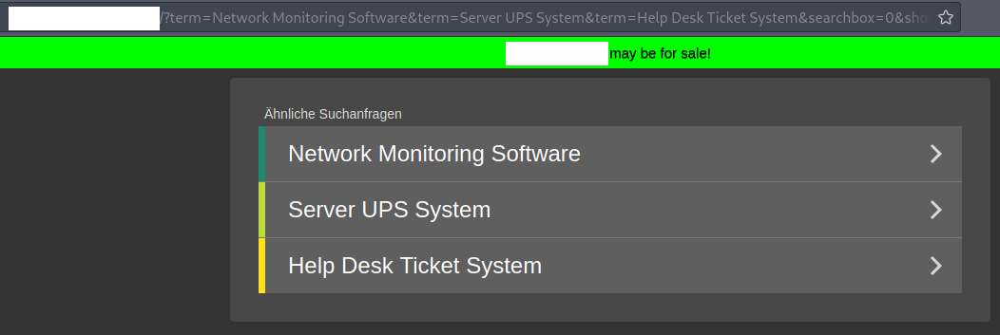
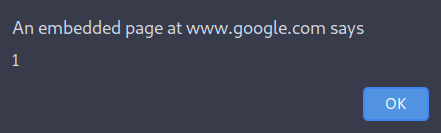

# Stumbling across a DOM XSS on google.com

This is a short writeup about a DOM XSS on google.com which I accidentally discovered.

## Discovery

The part, how I discovered this XSS, is the best part of this writeup. 

It was a usual day at my daywork as an IT engineer. I was sitting at home and was listening to some colleagues via a Skype conference. We were talking about an internal network in our own company infrastructure. Basically we just wanted to know, if there is already an active directory setup in that network. After some further discussion an other colleague came to help and told us, that there indeed is already an active directory setup. He also told us the domain name. And to our all surprise, the domain name looked like a usual FQDN. To keep that secret we just call that domain name `innernetwork.com`.

We were a bit wondered as we expected another domain name but I did not care too much. One of my colleagues then opened that domainname in a browser and obviously opened the website `innernetwork.com`. At that time he only saw a website to buy that very domain name. But he also saw a little detail, which caught my attention. He saw, that the URL parameters were reflected into the webpage.



As he told me about the reflection I was motivated to have a quick look at that. However, as I was connected to the company network, I could not open the page from the laptop I was using at the moment. So I just opened it from my phone and also saw the reflection. I quickly entered a usual XSS payload `">`. And to my surprise the XSS triggered! 

But to be honest: why would a XSS on a page, which is on sale, matter? That is also what I thought and wanted to close the browser again. But a small thing caught my attention:



`An embedded page on google.com`? Sure, it is obvious now as you only see the alert itself, but as I tried that on mobile, I did not see this at first. But why is that? Is that real? I changed the XSS payload to `">` and indeed saw a `google.com` in the alert page. But how is this happening? I was quite confused and tried on my personal laptop, with multiple browsers. I even asked a friend on mine to try that payload. But nothing changed. So, yes, the XSS was executing in the context of `google.com`!

## Proof of Concept

Even though I only popped the alert via a domain I did not own and I got no really working or understandable PoC I reported the issue to Google via https://bughunters.google.com/. In my report I showed them the alert, which gave proof that the XSS is running in the context of google.com. I also wrote, that I will deliver a full PoC later on.

However, the report was quickly rejected with the following cause:

> This application is not owned or operated by Google

Sure `innernetwork.com` is not owned or operated by Google, but the XSS was clearly running in the context of google.com. I explained that and worked myself down the code of `innernetwork.com` to get myself a working PoC.

At this point it is good to remember that `innernetwork.com` used the URL parameters, which reflected into the DOM. Appending HTML/JS to these parameters lead to an XSS. 

After having a first look at `innernetwork.com` I noticed, that the cause of the XSS is somewhere in Google's Addsense library. I simply used `">` as a payload and debugged my way through a lot of code of the Adsense library. If I understood the flow correctly Adsense is basically doing the following:

1. Getting the input parameters.
2. Loading an iframe within `google.com`.
3. Requesting the data to show in that iframe from `google.com/ads`.
4. Displaying the data in the iframe via setting the HTML with `innerHTML`.

Basically that's what the vulnerability was. The input parameters into the library were not correctly sanitized. The data in step 3 contained the parameters from the username inclusive with HTML and JS. Thus, when entered into the DOM in step 4, the XSS occurred.

To give a short spoiler Google fixed that quickly by returning sanitized HTML in step 3.

We now know how the XSS is triggered in general but we are stilling missing the PoC. 

The "caf" Adsense library used by `innernetwork.com` was not really documented and the calls to the library were quite hard to find. Additionally the Adsense library used quite a lot of different settings, which resulted also in different outcomes of the data of step 3. After an hour of debugging `innernetwork.com` to find the configuration they used to initialize the Adsense library I finally got the PoC working on my local client. 

The PoC is quite simple, as it used the "relatedsearch" feature of Google and inputs the XSS directly into the `terms`:

```js
var pageOptions = {
  type: "relatedsearch",
  linkTarget: "_top",
  columns: 1,
  number: 6,
  terms: 'XSS">',
  optimizeTerms: false,
  container: "aaa",
  rolloverLinkColor: "#5595E9",
  colorAttribution: "#b4b4b4",
  colorBackground: "transparent",
  attributionSpacingBelow: "2",
  attributionUppercase: false,
  attributionBold: false,
  fontSizeAttribution: "11px",
  colorTitleLink: "#e08d20",
  titleBold: false,
  fontSizeTitle: "24",
  lineHeightTitle: "40",
  noTitleUnderline: true,
  adIconUrl: "https://localhost/icon.png",
  adIconHeight: "18",
  adIconWidth: "18",
  adIconSpacingAbove: "10",
  adIconSpacingAfter: "10",
  verticalSpacing: "2",
  adBorderSelections: "bottom",
  colorAdBorder: "#525252",
};

var pageContentOptions = {
  adtest: "off",
  adsafe: "low",
  personalizedAds: false,
  resultsPageBaseUrl: "http://localhost",
  styleId: "0",
};

new google.ads.domains.Caf(pageOptions, pageContentOptions);
```

After I got the PoC working,I attached that to the report, which was already rejected. I thought I'd better create a new report because the rejected one might not be watched. Not even 10minutes after I submitted the second report, I got a message changing the status on the second report to `Duplicate`. Uff, I did not really know, what happened. The first report is rejected an the second is now a dupe? 
But shortly after that, the first report was reopened and accepted.

## Wrapup

Finding this XSS on Google was a great bust mostly fun experience. You don't always need lots of recon and hours of search to find vulnerabilities. Often times you just need luck - and that's what I had in this case. 

Even though the first report was quickly rejected I really liked the response and responsetimes from the team at Google. And also great job at creating [https://bughunters.google.com](https://bughunters.google.com) - I really like the looks of it.