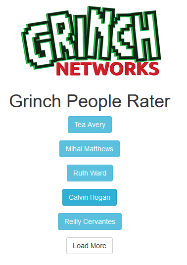

# Hackyholidays 2020

Everything about Hackyholidays 2020 from Hackerone.

I started playing on December 15th. That date the 3rd flag was already release and this was also the first one, I solved.

## Flag 3 - People Rater
Description: The grinch likes to keep lists of all the people he hates. This year he's gone digital but there might be a record that doesn't belong!

Screenshot: 

Pressing the "Load More" button just laods more name-buttons into the page. The button is pressable until 16 name-buttons are present. When pressing on a name-button an alert opens with a bad associated attribute such as "disgusting" or "weak" - just like the Grinch would do.

So, let's see what the page is doing under the hood.
The complete sourcecode of the page is here: [People Rater Sourcecode](./code/people-rater.md)

## Flag 1
robots.txt

## Flag 2
s3cr3t-ar3a found in robots.txt. 
nothing in sourcecode. 
jquery not from cdn?
weird, look at diff.
flag in property.
"proper way"

## Flag 4
fuzz until the end.
-> /sessions
gives userid and cookies.
no success with cookies.

-> /user
missing parameter uuid
use id from session

## Flag 5
fuzz login
access:computer

change cookie to admin=true
download zip
crack zip pw
find flag

