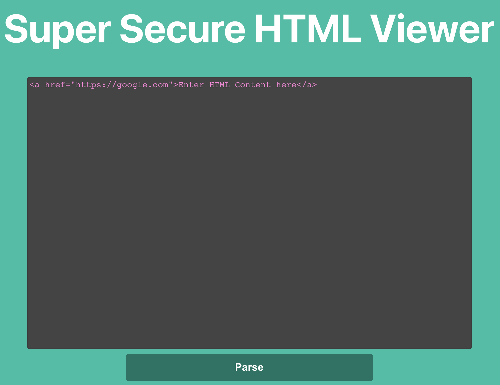
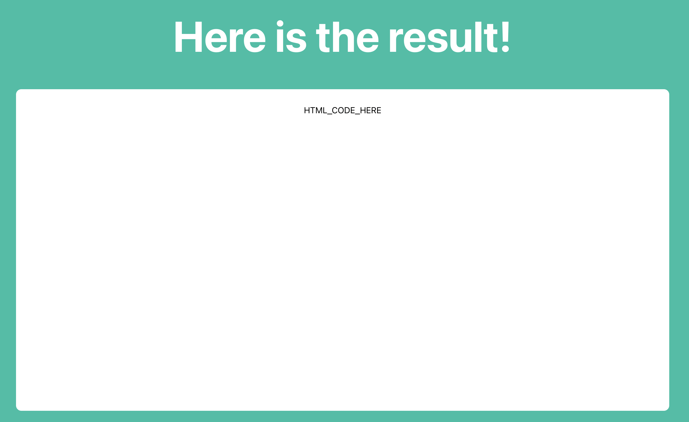
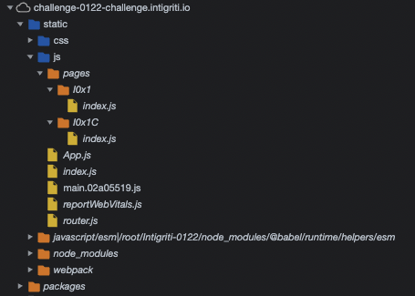
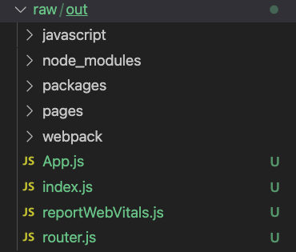
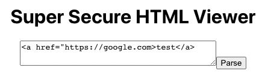

# Intigriti's January XSS challenge By @TheRealBrenu

## Target

The challenge is hosted at https://challenge-0122.intigriti.io, and the tweet about it is https://twitter.com/intigriti/status/1480525070472732677.

As stated on the challenge's page, we need to find a way to execute arbitrary javascript on the challenge page. However, there are a few rules and information:

```
Rules:
    This challenge runs from April 19 until April 25th, 11:59 PM CET.
    Out of all correct submissions, we will draw six winners on Monday, April 26th:
        Three randomly drawn correct submissions
        Three best write-ups
    Every winner gets a €50 swag voucher for our swag shop
    The winners will be announced on our Twitter profile.
    For every 100 likes, we'll add a tip to announcement tweet.

The solution...
    Should work on the latest version of Firefox or Chrome
    Should alert() the following flag: flag{THIS_IS_THE_FLAG}.
    Should leverage a cross site scripting vulnerability on this page.
    Shouldn't be self-XSS or related to MiTM attacks
    Should not use any user interaction
    Should be reported at go.intigriti.com/submit-solution
```

(taken from https://challenge-0122.intigriti.io / 01/12/2022 - 16:00 CET

## Hints

At the time solving this, there were no hints published.

## Inspecting and understanding the challenge

The challenge is taking place at [https://challenge-0122-challenge.intigriti.io](https://challenge-0122-challenge.intigriti.io/). The page is calling itself a "Super Secure HTML Viewer" and gives the user the possibility to enter HTML code, which will be displayed afterwards.



The result page takes the user inputted HTML value as an URL parameter and shows it rendered in the DOM. For example the URL [https://challenge-0122-challenge.intigriti.io/result?payload=HTML_CODE_HERE](https://challenge-0122-challenge.intigriti.io/result?payload=HTML_CODE_HERE) results in the following:



This hints already in the direction, that we should change the parameter to something, which results in a XSS. However, basic XSS payloads like `` do not work:
[https://challenge-0122-challenge.intigriti.io/result?payload=%3Cimg%20src%3Dx%20onerror%3Dalert(document.domain)%3E](<https://challenge-0122-challenge.intigriti.io/result?payload=%3Cimg%20src%3Dx%20onerror%3Dalert(document.domain)%3E>)

### Inspecting the source code

Best way to understand is an analysis of the application's source code. Having a look at the requested ressources, we see the file https://challenge-0122-challenge.intigriti.io/static/js/main.02a05519.js as the main javascript file. However when opening this file, we see a reference to https://challenge-0122-challenge.intigriti.io/static/js/main.02a05519.js.LICENSE.txt. Having a look at this shows, that the application is an application developed with the modern web-framework [React](https://reactjs.org/).

If we take a look at the "Sources" tab of the Chrome DevTools, we suddenly see more JavaScript files, than just the main.js file:



But why is that? The answer is sourcemaps.

#### Understanding sourcemaps in general

I prepared a small demo project to better understand sourcemaps. The demo project has two main files:

1. `src/main.js`

```js
import random from "./random.js";

console.log(random());
```

2. `src/random.js`

```js
/**
 * Generates a random number between 0 and 1.
 *
 * @export
 * @return {number} A random number between 0 and 1.
 */
export default function random() {
  return Math.random();
}
```

The project basically just logs a random number. The script to generate the random number is based on another file. With the command `yarn build` we can build the project, which generates a `dist/main.js` and a `dist/main.js.map` file.

1. `dist/main.js`

```js
(()=>{"use strict";console.log(Math.random());})();
//# sourceMappingURL=main.js.map
```

2. `dist/main.js.map`

```json
{
  "version": 3,
  "file": "main.js",
  "mappings": "mBAEAA,QAAQC,ICKCC,KAAKC,W",
  "sources": [
    "webpack://sourcemaps-test/./src/main.js",
    "webpack://sourcemaps-test/./src/random.js"
  ],
  "sourcesContent": [
    "import random from \"./random.js\";\n\nconsole.log(random());\n",
    "/**\n * Generates a random number between 0 and 1.\n *\n * @export\n * @return {number} A random number between 0 and 1.\n */\nexport default function random() {\n  return Math.random();\n}\n"
  ],
  "names": ["console", "log", "Math", "random"],
  "sourceRoot": ""
}
```

The `main.js.map` file is referenced from the `main.js` file in a comment in the last line: `//# sourceMappingURL=main.js.map`
This tells applications, browsers or debuggers the location of the sourcemaps for this exact file. Sourcemaps can either be outsourced in another file, or can also be inline, where the contents of the `main.js.map` file are appended as a base64 string. Inline sourcemaps can be generated in the demo project by issuing a `yarn build:inline-sourcemap`, which will generate the following single `dist/main.js` file:

```js
(()=>{"use strict";console.log(Math.random());})();
//# sourceMappingURL=data:application/json;charset=utf-8;base64,eyJ2ZXJzaW9uIjozLCJmaWxlIjoibWFpbi5qcyIsIm1hcHBpbmdzIjoibUJBRUFBLFFBQVFDLElDS0NDLEtBQUtDLFciLCJzb3VyY2VzIjpbIndlYnBhY2s6Ly9zb3VyY2VtYXBzLXRlc3QvLi9zcmMvbWFpbi5qcyIsIndlYnBhY2s6Ly9zb3VyY2VtYXBzLXRlc3QvLi9zcmMvcmFuZG9tLmpzIl0sInNvdXJjZXNDb250ZW50IjpbImltcG9ydCByYW5kb20gZnJvbSBcIi4vcmFuZG9tLmpzXCI7XG5cbmNvbnNvbGUubG9nKHJhbmRvbSgpKTtcbiIsIi8qKlxuICogR2VuZXJhdGVzIGEgcmFuZG9tIG51bWJlciBiZXR3ZWVuIDAgYW5kIDEuXG4gKlxuICogQGV4cG9ydFxuICogQHJldHVybiB7bnVtYmVyfSBBIHJhbmRvbSBudW1iZXIgYmV0d2VlbiAwIGFuZCAxLlxuICovXG5leHBvcnQgZGVmYXVsdCBmdW5jdGlvbiByYW5kb20oKSB7XG4gIHJldHVybiBNYXRoLnJhbmRvbSgpO1xufVxuIl0sIm5hbWVzIjpbImNvbnNvbGUiLCJsb2ciLCJNYXRoIiwicmFuZG9tIl0sInNvdXJjZVJvb3QiOiIifQ==
```

To further understand sourcemaps, we have a look at `dist/main.js.map`. The field `"sources"` describes the source files, which are used to build that exact script. In our case we can see our two source files `src/main.js` and `src/random.js`. The next field is `"sourcesContent"` and shows the source content of the previously mentioned files. This is great for debugging.

The magic though lies in the `"mappings"` field. This field is a list of pointers, which connects the generated file with the source files. The way these values are encoded is the so called Base64 VLQ format and has a great description at an rather old [HTML5Rocks page](https://www.html5rocks.com/en/tutorials/developertools/sourcemaps/#toc-base64vlq). Another great tool is the VLQ De-/Encoder tool at [https://www.murzwin.com/base64vlq.html](https://www.murzwin.com/base64vlq.html).
If we input our mappings `"mBAEAA,QAAQC,ICKCC,KAAKC,W"` into that tool, we can perfectly see, how these mappings are interpreted:

The result of the VLQ in general is the following data:

```
[19,0,2,0,0], [8,0,0,8,1], [4,1,5,1,1], [5,0,0,5,1], [11]
```

This data is now interpreted in the following format:

```
(([from_position](source_index)=>[to_position]))
```

Which is resulting in the following mapppings:

```
([2,0](#0)=>[0,19]) | ([2,8](#0)=>[0,27]) | ([7,9](#1)=>[0,31]) | ([7,14](#1)=>[0,36])
```

Let's just focus on this part `([7,9](#1)=>[0,31])` for now. We should keep in mind, that these numbers are 0-indexed. To find the correct line and column, we have to add 1 to each.
The string `([7,9](#1)=>[0,31])` basically means the following:
The part of file `#1`, which is `src/random.js`, starting at line 8 and column 10, is mapped to the output file at line 0 and column 32.

We can verify this if we look at line 8 and column 10 of `random.js`, we will find the following: `Math.random()`

If we now look at the output file at line 0 and column 32: `Math.random()`

Greate visualization offers [sokras sourcemap visualizer](https://sokra.github.io/source-map-visualization/#base64,KCgpPT57InVzZSBzdHJpY3QiO2NvbnNvbGUubG9nKE1hdGgucmFuZG9tKCkpfSkoKTsKLy8jIHNvdXJjZU1hcHBpbmdVUkw9bWFpbi5qcy5tYXA=,eyJ2ZXJzaW9uIjozLCJmaWxlIjoibWFpbi5qcyIsIm1hcHBpbmdzIjoibUJBRUFBLFFBQVFDLElDS0NDLEtBQUtDLFciLCJzb3VyY2VzIjpbIndlYnBhY2s6Ly9zb3VyY2VtYXBzLXRlc3QvLi9zcmMvbWFpbi5qcyIsIndlYnBhY2s6Ly9zb3VyY2VtYXBzLXRlc3QvLi9zcmMvcmFuZG9tLmpzIl0sInNvdXJjZXNDb250ZW50IjpbImltcG9ydCByYW5kb20gZnJvbSBcIi4vcmFuZG9tLmpzXCI7XG5cbmNvbnNvbGUubG9nKHJhbmRvbSgpKTtcbiIsIi8qKlxuICogR2VuZXJhdGVzIGEgcmFuZG9tIG51bWJlciBiZXR3ZWVuIDAgYW5kIDEuXG4gKlxuICogQGV4cG9ydFxuICogQHJldHVybiB7bnVtYmVyfSBBIHJhbmRvbSBudW1iZXIgYmV0d2VlbiAwIGFuZCAxLlxuICovXG5leHBvcnQgZGVmYXVsdCBmdW5jdGlvbiByYW5kb20oKSB7XG4gIHJldHVybiBNYXRoLnJhbmRvbSgpO1xufVxuIl0sIm5hbWVzIjpbImNvbnNvbGUiLCJsb2ciLCJNYXRoIiwicmFuZG9tIl0sInNvdXJjZVJvb3QiOiIifQ==,aW1wb3J0IHJhbmRvbSBmcm9tICIuL3JhbmRvbS5qcyI7Cgpjb25zb2xlLmxvZyhyYW5kb20oKSk7Cg==,LyoqCiAqIEdlbmVyYXRlcyBhIHJhbmRvbSBudW1iZXIgYmV0d2VlbiAwIGFuZCAxLgogKgogKiBAZXhwb3J0CiAqIEByZXR1cm4ge251bWJlcn0gQSByYW5kb20gbnVtYmVyIGJldHdlZW4gMCBhbmQgMS4KICovCmV4cG9ydCBkZWZhdWx0IGZ1bmN0aW9uIHJhbmRvbSgpIHsKICByZXR1cm4gTWF0aC5yYW5kb20oKTsKfQo=), which also shows these mappings on the bottom of the page.

### Understanding the challenge further

Now that we have the source of the generated React application, we can have further looks on it.

Unfortunately I did not found a script or tool, which downloads the sourcemaps and generates the original sources from it. But nevertheless, this is not too complicated and thus I wrote such script on my own, which is available at [https://github.com/svennergr/originmap](https://github.com/svennergr/originmap).

With this tool I can download the sourcemap from the challenge and recreate the files local:

```
curl https://challenge-0122-challenge.intigriti.io/static/js/main.02a05519.js.map -o- | originmap
```

This will generate all the source files found in the sourcemap, resulting in a structure like this:



### Creating the React app locally

Since we already know, that this application is a React application, we can recreate it to make local changes and test them directly. At first we are cleaning the generated sourcefiles from files, which we do not need. This are all files except files in the root of the `out` folder and `pages` folder. This will result in the following structure:


Then we will use the tool `create-react-app` to create a new React application:

```
npx create-react-app debug-0122
```

Once this is created - for this writeup the app is stored in [challenge-app/debug-0122](https://github.com/svennergr/writeups/tree/master/inti/0122/challenge-app/debug-0122) - we copy the left over source files generated from the sourcemap to that newly created React app's `src` file:

```
cp -r raw/out/* debug-0122/src
```

Now we can simply start the local React app with a `yarn start`. This should open a browser, displaying these error messages:

```
ERROR in ./src/pages/I0x1/index.js 7:0-34

Module not found: Error: Can't resolve 'dompurify' in '/Users/sven/repos/writeups/inti/0122/challenge-app/debug-0122/src/pages/I0x1'


ERROR in ./src/pages/I0x1C/index.js 7:0-47

Module not found: Error: Can't resolve 'react-router-dom' in '/Users/sven/repos/writeups/inti/0122/challenge-app/debug-0122/src/pages/I0x1C'


ERROR in ./src/router.js 4:0-64

Module not found: Error: Can't resolve 'react-router-dom' in '/Users/sven/repos/writeups/inti/0122/challenge-app/debug-0122/src'
```

Sure, the application needs some dependencies, which are not yet installed locally. Let's do that by using `yarn add react-router-dom dompurify` and restart with `yarn start`.

This time the application loads successful. Eventhough the app does not look like the online application at the challenge page, the app itself is working properly:



Even the result is working:


### Source Code Analysis

Now we can continue with the source code analysis of the application by having a look at the file at `src/pages/I0x1C/index.js`. We can see relative quickly, that the file is still somehow obufscated because of several calls like `window.atob(identifiers["I0x4"])`. `identifiers` is taken in as an argument to the main function of this file. The origin of `identifiers` is in the `src/router.js` file, where identifier is a map between the keys and some base64 encoded values:

```js
const identifiers = {
  I0x1: "UmVzdWx0",
  I0x2: "cGF5bG9hZEZyb21Vcmw=",
  I0x3: "cXVlcnlSZXN1bHQ=",
  I0x4: "bG9jYXRpb24=",
  I0x5: "c2VhcmNo",
  I0x6: "Z2V0",
  I0x7: "cGF5bG9hZA==",
  I0x8: "cmVzdWx0",
  I0x9: "X19odG1s",
  ...
```

So the app is taking the base64 encoded value via a key and is decoding it to use it in the page. Instead of following each call manually and manually decoding these values, I wrote a small script, which takes in the `identifiers`, searchs for any call like `window.atob(identifiers[ANY_KEY])` and replaces them with the respective base64 decoded value. The script is stored at [challenge-app/debug-0122/deobfuscate.js](challenge-app/debug-0122/deobfuscate.js) and can be called in the React app via `yarn deobfuscate`.

After calling this, all occurences of `window.atob(identifiers[ANY_KEY])` are replaced with their corresponding decoded values. For example

```js
const I0x3 = new URLSearchParams(
  window[window.atob(identifiers["I0x4"])][window.atob(identifiers["I0x5"])]
)[window.atob(identifiers["I0x6"])](window.atob(identifiers["I0x7"]));
```

is replaced with

```js
const I0x3 = new URLSearchParams(window["location"]["search"])["get"](
  "payload"
);
```

which is much more readable.

If we now open [`src/pages/I0x1C/index.js`](src/pages/I0x1C/index.js) with a code editor - for example Visual Studio Code - and format the file with any JS Formatter, we get some nice readable file. There are still some function names obfuscated, but we can quickly scan through the file and refactor these.

`I0x1` will stay the same, as this is the name of the main component. `I0x12` is something like `sanitize` with it's argument `I0x13` being `htmlInput`. `I0x14` is a `templateElement`. This will result in the follwowing `sanitize` function, which is responsible for the display of the HTML element:

```js
function sanitize(htmlInput) {
  htmlInput["__html"] = DOMPurify["sanitize"](htmlInput["__html"]);

  let templateElement = document["createElement"]("template");
  templateElement["innerHTML"] = htmlInput["__html"];
  document["body"]["appendChild"](templateElement);

  templateElement = document["getElementsByTagName"]("template")[0];
  I0xB(templateElement["content"]);

  document["body"]["removeChild"](templateElement);

  return htmlInput;
}
```

Because the result of this method is used by React's `dangerouslySetInnerHTML` method in line 52 of `src/pages/I0x1C/index.js` the app can display HTML.

The `sanitize` function makes a call to `DOMPurify.sanitize`, which removes all XSS relevant code. Since the app is using an uptodate version of DOMPurify, bypasses are not known for this. There must be an other way to have XSS, since this is call is safe. And indeed there is a strange call to the `I0xB` method with the `templateElement`.

`I0xB` looks like this:

```js
function I0xB(I0xC) {
for (const I0xD of I0xC["children"]) {
    if ("data-debug" in I0xD["attributes"]) {
    new Function(I0xD["getAttribute"]("data-debug"))();
    }

    I0xB(I0xD);
}
```

This function is even without refactoring quite readable. It is iterating over all children of the content's of the `templateElement`. If any of the children has an attribute named `data-debug`, a new Function is formed with the string from this particular attribute and directly called. So, this is basically the vulnerability leading to XSS!

If we test this, by calling [https://challenge-0122-challenge.intigriti.io/result?payload=%3Ca%20data-debug=alert(document.domain)%3Ea%3C/a%3E](https://challenge-0122-challenge.intigriti.io/result?payload=%3Ca%20data-debug=alert(document.domain)%3Ea%3C/a%3E) we successfully get an alert popped.

## TL;DR;

1. Sourcemaps of the challenge page are enabled.
2. [https://github.com/svennergr/originmap](https://github.com/svennergr/originmap) is used to parse the sourcemaps to it's source files locally.
3. A react app is created from these sources.
4. A script is used to replace all calls `window.atob(identifiers[ANY_KEY])` with their corresponding values.
5. A sourcecode review shows the vulnerability by using the `data-debug` attribute.
6. XSS is shown via [https://challenge-0122-challenge.intigriti.io/result?payload=%3Ca%20data-debug=alert(document.domain)%3Ea%3C/a%3E](https://challenge-0122-challenge.intigriti.io/result?payload=%3Ca%20data-debug=alert(document.domain)%3Ea%3C/a%3E)

## What did we learn?

I learned a lot about the internals of sourcemaps. In addition I developed a small tool parsing sources from these maps: [https://github.com/svennergr/originmap](https://github.com/svennergr/originmap)

This writeup contains a test project to show the use of sourcemaps: [./sourcemaps-test](https://github.com/svennergr/writeups/tree/master/inti/0122/sourcemaps-test)
It also contains the raw files which are generated by [originmap](https://github.com/svennergr/originmap): [./challenge-app/raw](https://github.com/svennergr/writeups/tree/master/inti/0122/challenge-app/raw)
It also contains a React app, which recreates the challenge locally and was used to deobfuscate it: [./challenge-app/debug-0122](https://github.com/svennergr/writeups/tree/master/inti/0122/challenge-app/debug-0122)
